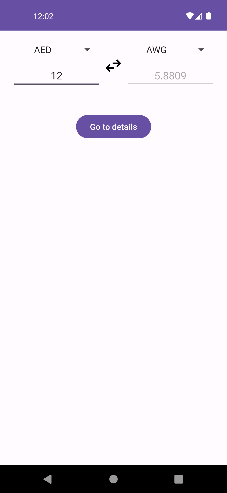
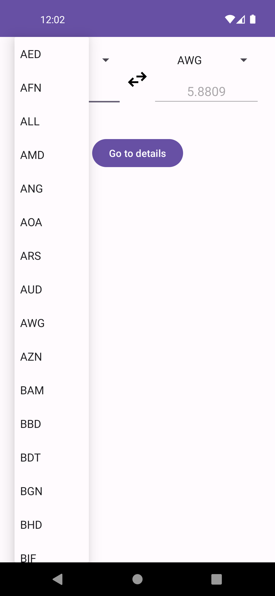
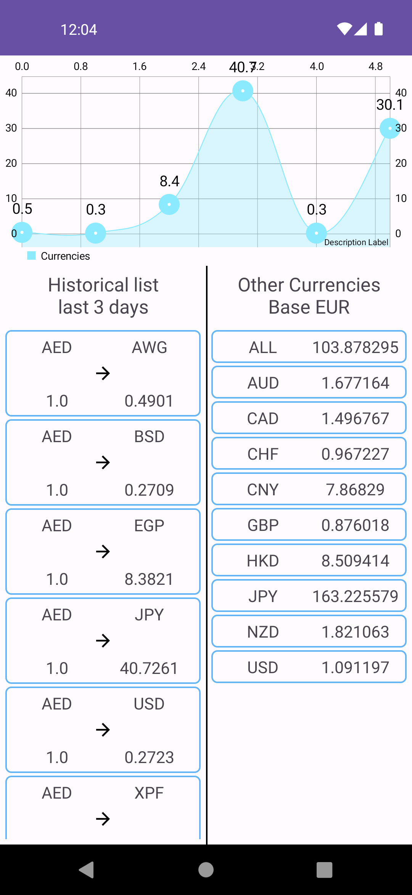

# Currency Application

 

    
    
    

 

## The app has following packages:
1. **Data Layer (Repository/DataSource)**: Manages the app's data sources, encapsulating the logic for data retrieval and storage, such as accessing databases, making network requests, or handling local caching.
2. **Domain Layer (Use Cases/Interactors)**: Contains the business logic and rules of the application, orchestrating data flow between the data layer and the presentation layer, ensuring the integrity and consistency of the app's core functionality.
3. **Presentation Layer (UI/ViewModels)**: Handles the user interface, presenting data from the domain layer to the user, and capturing user input to be processed by the domain layer. It focuses on delivering a seamless and interactive user experience.
 

## Uses:
1. Retrofit
2. Room
3. Coroutines
4. Hilt for dependency injection
5. DataBinding
6. Navigation Component
7. Unit test using mockk
 